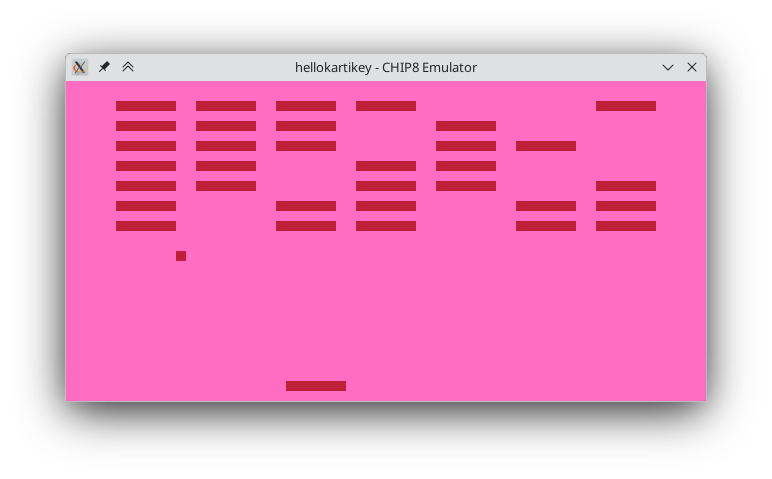

# CHIP8 Interpreter

A simple CHIP-8 emulator written in C++



## Dependencies
All library dependencies are downloaded and linked statically using CMake.

The project depends on
-   raylib
-   {fmt}

Optional dependencies for testing
-   GoogleTest

The project also uses tools for static analysis and formating
-   Clang-Tidy
-   Clang-Format

## Build

Build options
-   `-DBUILD_TESTS=ON` : Build unit tests
-   `-DCLANG_TIDY=ON` : Enable clang-tidy static analysis
-   `-DCLANG_FORMAT=ON` : Enable clang-format code formatting

```bash
git clone https://github.com/hellokartikey/chip8
cd chip8
cmake -B build
cmake --build build
./build/bin/chip8
```

## Test

```bash
cd build
ctest
```
